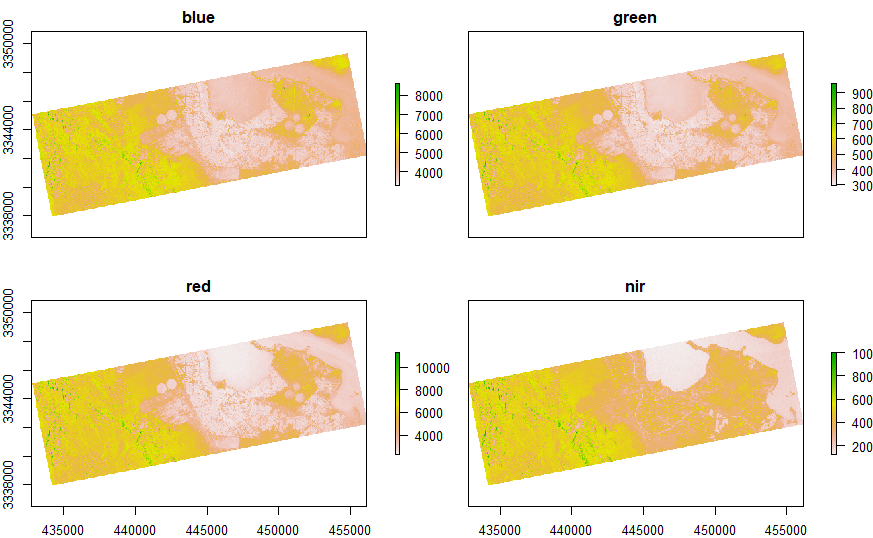
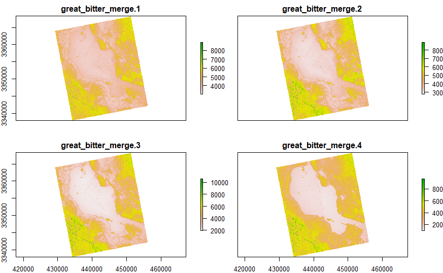
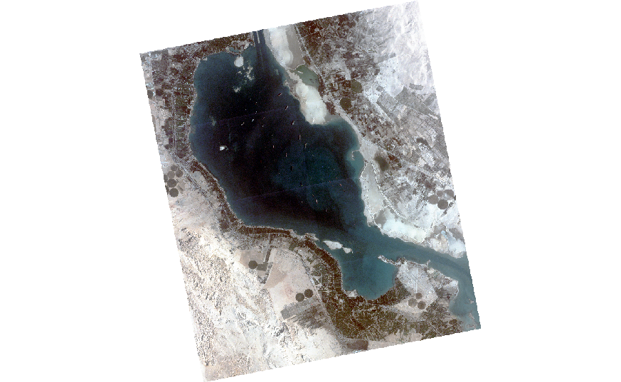

# PlanetScope-Merge-raster

# PlanetScope-Ever-Green-Ship-Blockage

# Explore up-to-date high resolution 4-band PlanetScope 
## Greate Bitter Lake

## EverGreen Ship
### Location: Great Bitter Lake, Egypt
### Image: 4-band PlanetScope 
### Resolution: 3 m
### Provider: Planet Lab
### Thanks to Planet Lab for the data for Education and Research Program

## 1. Load library
```
library(raster)
```

## 2. Read raster stacks
### 2.1 Create list
```
great_bitter = list()
```
### 2.2 Read different files and store in a list
```
great_bitter[[1]] = stack("20210325_053032_0f2b/analytic_udm2/20210325_053032_0f2b_3B_AnalyticMS.tif")

great_bitter[[2]] = stack("20210325_053033_0f2b/analytic_udm2/20210325_053033_0f2b_3B_AnalyticMS.tif")

great_bitter[[3]] = stack("20210325_053034_0f2b/analytic_udm2/20210325_053034_0f2b_3B_AnalyticMS.tif")

great_bitter[[4]] = stack("20210325_053035_0f2b/analytic_udm2/20210325_053035_0f2b_3B_AnalyticMS.tif")
```

### 2.3 Check the stack
```
plot(great_bitter[[1]])

plot(great_bitter[[1]][[1]])  # Blue
plot(great_bitter[[1]][[2]])  # Green
plot(great_bitter[[1]][[3]])  # Red
plot(great_bitter[[1]][[4]])  # NIR
```
<!-- -->

## 3. Merge raster and export in GeoTiff format
```
great_bitter_merge = merge(great_bitter[[1]], 
                           great_bitter[[2]],
                           great_bitter[[3]], 
                           great_bitter[[4]], 
                           tolerance=0.05,
                           filename="great_bitter_merge",
                           overlap=TRUE,
                           ext=NULL, 
                           overwrite = TRUE,
                           format="GTiff")

```

## 4. Plot 4-band merged PlanetScope
```
plot(great_bitter_merge)
```

<!-- -->

## 5. Plot RGB
```
plotRGB(great_bitter_merge,
        r = 3, g = 2, b = 1,
        stretch = "hist",
        legend = FALSE,
        axes = FALSE,
        box = FALSE)
```
<!-- -->

## DONE! 
### Ready for further analysis
